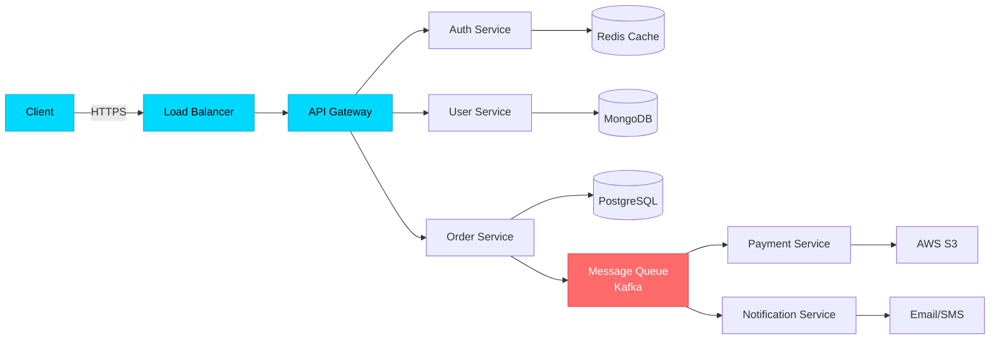
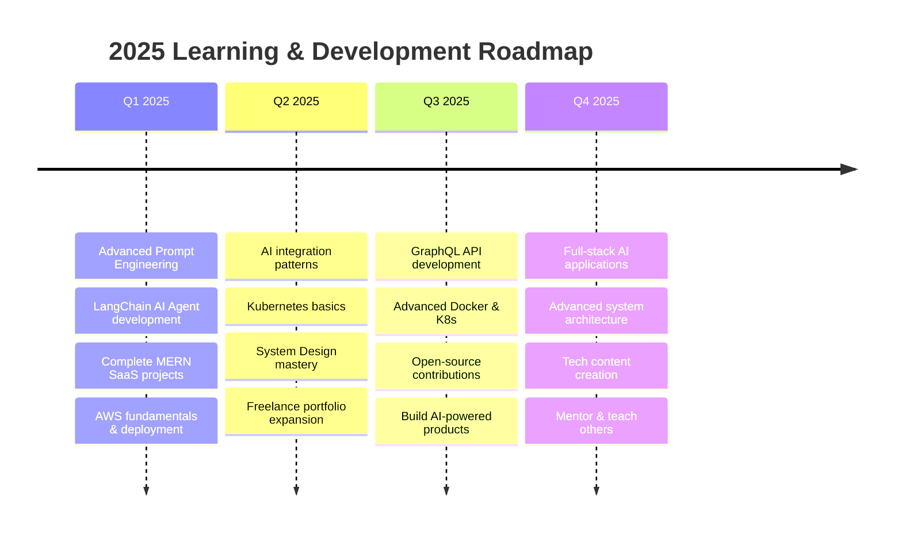

 <div align="center">

#  Hi, I'm Aiden (Shivam Kumar Sharma)


### 🚀 Full-Stack MERN Developer | Freelancer | Prompt Engineer | AI Enthusiast

[](https://github.com/Aiden781Xx)
[](https://github.com/Aiden781Xx)
[](https://github.com/Aiden781Xx)
[](https://github.com/Aiden781Xx/Aiden781Xx/actions/workflows/snake.yml)

</div>


##  About Me

```typescript
const aiden = {
  role: "Full-Stack MERN Developer",
  workStatus: "Freelancer & Open to Opportunities 💼",
  specialization: "Prompt Engineering & AI Integration",
  location: "Delhi, India 🇮🇳",
  
  expertise: {
    fullStack: ["MongoDB", "Express.js", "React.js", "Node.js"],
    frontend: ["Next.js", "TypeScript", "Tailwind CSS", "React Hooks"],
    backend: ["RESTful APIs", "GraphQL", "JWT Auth", "Microservices"],
    databases: ["MongoDB", "MySQL", "PostgreSQL", "Redis"],
    aiTools: ["ChatGPT API", "Claude API", "Prompt Engineering", "LangChain"],
    devOps: ["Docker", "CI/CD", "AWS", "GitHub Actions"]
  },
  
  currentlyLearning: [
    "Advanced Prompt Engineering techniques",
    "AI Agent development with LangChain",
    "Kubernetes & Container Orchestration",
    "System Design at scale"
  ],
  
  freelanceServices: [
    "Full-Stack MERN Development",
    "Custom AI Integration & Chatbots",
    "Prompt Engineering Consulting",
    "API Development & Integration",
    "Web App Development & Deployment"
  ],
  
  philosophy: "Build AI-powered solutions that solve real problems 🤖🚀"
};
```


##  Tech Stack & Expertise

<div align="center">

### 💻 Languages & Frameworks


### 🤖 AI & Prompt Engineering


### 🤖 AI & Prompt Engineering


### 🗄️ Databases & Caching


### ☁️ Cloud & DevOps


### 🛠️ Tools & Technologies


</div>


## 📊 Skill Proficiency & Learning Progress

<div align="center">

### 🎯 Core Competencies

| Technology | Proficiency | Experience | Status |
|:-----------|:------------|:-----------|:-------|
| **MERN Stack** |  | 2+ years | 🔥 Expert |
| **React.js + Next.js** |  | 2+ years | 🔥 Expert |
| **Node.js + Express** |  | 2+ years | ⚡ Advanced |
| **MongoDB** |  | 2+ years | ⚡ Advanced |
| **Prompt Engineering** |  | 1+ year | ⚡ Advanced |
| **JavaScript/TypeScript** |  | 2+ years | 🔥 Expert |
| **REST API Design** |  | 2+ years | 🔥 Expert |
| **ChatGPT/Claude API** |  | 1+ year | ⚡ Advanced |
| **Tailwind CSS** |  | 1.5+ years | ⚡ Advanced |
| **Docker & CI/CD** |  | 1+ year | 📈 Intermediate |

### 🌱 Currently Learning

| Technology | Progress | Target | Status |
|:-----------|:---------|:-------|:-------|
| **Advanced Prompt Engineering** |  | Ongoing | 🎯 Active |
| **LangChain & AI Agents** |  | Jan 2025 | 🎯 Active |
| **AWS Solutions Architecture** |  | Mar 2025 | 🎯 Active |
| **Kubernetes** |  | Feb 2025 | 📚 Learning |
| **System Design Patterns** |  | Ongoing | 🎯 Active |
| **GraphQL** |  | Mar 2025 | 📚 Learning |
| **Apache Kafka** |  | Q2 2025 | 📚 Learning |

</div>


##  Architecture & System Design

<div align="center">



### 🏗️ Architecture Patterns I Work With

<table>
<tr>
<td width="33%" align="center">

<br><strong>Microservices</strong>
<br>Event-Driven Architecture
</td>
<td width="33%" align="center">

<br><strong>RESTful APIs</strong>
<br>Clean Architecture Pattern
</td>
<td width="33%" align="center">

<br><strong>Cloud Native</strong>
<br>Containerized Deployments
</td>
</tr>
</table>

</div>


## 🏆 Featured Projects

<div align="center">

<table>
<tr>
<td width="50%">

### 📚 E-Learning Platform


**Production-Ready MERN Stack Application**

```yaml
Architecture:
  ├─ Role-Based Access Control (RBAC)
  ├─ JWT Authentication & Authorization
  ├─ Video Streaming (AWS S3)
  ├─ Payment Gateway Integration
  └─ Course Management System

Tech Stack:
  Backend: Node.js, Express, MongoDB, Redis
  Frontend: React, Redux, TailwindCSS
  Cloud: AWS S3, EC2
  Auth: JWT, bcrypt, OAuth2.0
```

[](https://github.com/Aiden781Xx)
[](https://demo.com)

</td>
<td width="50%">

### 📊 Real-Time Analytics Dashboard


**High-Performance Data Pipeline**

```yaml
Features:
  ├─ Real-Time Data Visualization
  ├─ MongoDB Aggregation Pipeline
  ├─ Redis Caching Layer
  ├─ Rate Limiting & Throttling
  └─ Responsive Chart.js Dashboard

Tech Stack:
  Backend: Express, MongoDB, Redis
  Frontend: React, Chart.js, D3.js
  Deploy: Docker, AWS EC2, Nginx
  Monitor: PM2, CloudWatch
```

[](https://github.com/Aiden781Xx)
[](https://demo.com)

</td>
</tr>
<tr>
<td width="50%">

### 🤖 AI-Powered Chat Application


**Full-Stack MERN + AI Integration**

```yaml
Features:
  ├─ ChatGPT/Claude API Integration
  ├─ Context-Aware Conversations
  ├─ Prompt Engineering Templates
  ├─ Real-time Response Streaming
  └─ User History & Analytics

Tech Stack:
  Backend: Node.js, Express, MongoDB
  Frontend: React, TypeScript, TailwindCSS
  AI: OpenAI API, Claude API
  Real-time: Socket.io
```

[](https://github.com/Aiden781Xx)
[](https://demo.com)

</td>
<td width="50%">

### 🎨 SaaS Project Management Tool


**Production-Ready MERN Application**

```yaml
Features:
  ├─ Kanban Board & Task Management
  ├─ Real-time Collaboration
  ├─ Role-Based Access Control
  ├─ File Upload (AWS S3)
  └─ Payment Integration (Stripe)

Tech Stack:
  Backend: Node.js, Express, MongoDB, Redis
  Frontend: Next.js, Redux, Tailwind
  Cloud: AWS S3, Vercel
  Payments: Stripe API
```

[](https://github.com/Aiden781Xx)
[](https://demo.com)

</td>
</tr>
</table>

</div>


## 📈 GitHub Analytics

<div align="center">


<br><br>


<br>


<br><br>


</div>


## 🐍 Contribution Snake Animation

<div align="center">

<picture>
  <source media="(prefers-color-scheme: dark)" srcset="https://raw.githubusercontent.com/Aiden781Xx/Aiden781Xx/output/github-contribution-grid-snake-dark.svg">
  <source media="(prefers-color-scheme: light)" srcset="https://raw.githubusercontent.com/Aiden781Xx/Aiden781Xx/output/github-contribution-grid-snake.svg">
  
</picture>

<br>

**🎮 Watch the snake eat my contributions! Updates every 12 hours.**

[](https://github.com/Aiden781Xx/Aiden781Xx/actions/workflows/snake.yml)

</div>


## 🎯 Current Learning Roadmap

<div align="center">



### 🎓 Learning Goals & Certifications

| Goal | Status | Target Date |
|------|--------|-------------|
| Advanced Prompt Engineering | 🎯 In Progress | Ongoing |
| LangChain & AI Agents | 🎯 In Progress | Jan 2025 |
| AWS Solutions Architect Associate | 📚 Planned | Mar 2025 |
| System Design Mastery | 🎯 In Progress | Ongoing |
| GraphQL Expert | 📚 Planned | Q2 2025 |
| Freelance 10+ Projects | 🎯 In Progress | Dec 2025 |

</div>


## 🌟 Development Philosophy

<div align="center">

<table>
<tr>
<td width="25%" align="center">
<br>
<strong>MERN Mastery</strong><br>
<sub>Full-stack excellence</sub>
</td>
<td width="25%" align="center">
<br>
<strong>AI Integration</strong><br>
<sub>Prompt engineering expert</sub>
</td>
<td width="25%" align="center">
<br>
<strong>Client-Focused</strong><br>
<sub>Freelance excellence</sub>
</td>
<td width="25%" align="center">
<br>
<strong>Fast Delivery</strong><br>
<sub>Quality & speed balance</sub>
</td>
</tr>
</table>

### 💭 Code Philosophy

> **"The best code is no code at all. The second best is simple, readable code."** - Jeff Atwood

```python
class FreelanceDeveloper:
    def __init__(self):
        self.stack = ["MongoDB", "Express", "React", "Node.js"]
        self.speciality = "AI-Powered Web Applications"
        self.mindset = "Client Success is My Success"
        
    def daily_routine(self):
        return [
            "☕ Coffee",
            "💼 Client Communication",
            "💻 Code & Build",
            "🤖 AI Integration",
            "🚀 Deploy",
            "📚 Learn New Tech"
        ]
    
    def freelance_values(self):
        return {
            "communication": "Regular updates",
            "quality": "Production-ready code",
            "deadline": "Always on time",
            "support": "Post-delivery assistance"
        }
```

</div>


## 📫 Connect With Me

<div align="center">

[](https://linkedin.com/in/yourprofile)
[](https://twitter.com/yourprofile)
[](mailto:your.email@example.com)
[](https://yourportfolio.com)
[](https://dev.to/yourprofile)
[](https://medium.com/@yourprofile)

<br>

### 💬 Let's Collaborate!

**I'm available for:**
- 💼 Freelance MERN Stack Projects
- 🤖 AI-Powered Web Applications
- 🎨 Custom Web Development
- 🚀 API Development & Integration
- 💡 Prompt Engineering Consulting
- 🎓 Technical Mentoring

**💰 Hourly Rate:** Competitive | **📅 Availability:** Open for new projects

**Feel free to reach out for project discussions or collaborations!**


</div>


## 🏆 GitHub Trophies

<div align="center">


</div>


## 📊 Weekly Development Stats

<!--START_SECTION:waka-->
<!--END_SECTION:waka-->

<div align="center">


<br>


<br><br>

**⭐ If you like my work, consider giving a star to my repositories!**


</div>
