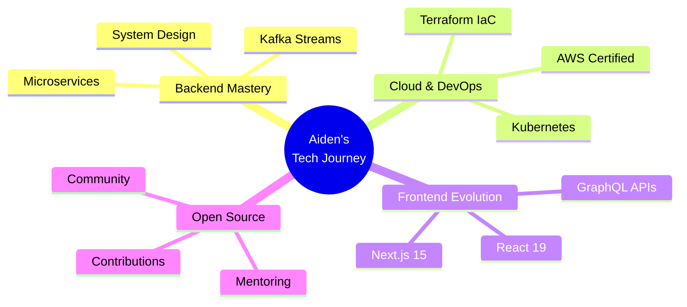

<div align="center">


<br>

[](https://www.linkedin.com/in/shivam-sharma-193226311/)
[](https://personalshivamglbajaj.netlify.app/)
[](mailto:shivambhardwaj750000@gmail.com)
[](https://github.com/Aiden781Xx)

</div>


##  About Me

```javascript
const aiden = {
  location: "Delhi, India 🇮🇳",
  role: "Full-Stack MERN Developer",
  currentFocus: ["Backend Architecture", "System Design", "Cloud Infrastructure"],
  techStack: {
    backend: ["Node.js", "Express", "REST APIs", "Microservices"],
    frontend: ["React", "Next.js", "TypeScript", "Tailwind"],
    databases: ["MongoDB", "PostgreSQL", "MySQL", "Redis"],
    cloud: ["AWS", "Docker", "CI/CD"]
  },
  learning: ["Kubernetes", "Apache Kafka", "GraphQL", "AWS Solutions Architecture"],
  philosophy: "Build scalable, Ship fast, Automate everything 🚀"
};
```


##  Tech Arsenal

<div align="center">

<table>
<tr>
<td align="center" width="96">

<br>JavaScript
</td>
<td align="center" width="96">

<br>TypeScript
</td>
<td align="center" width="96">

<br>Node.js
</td>
<td align="center" width="96">

<br>Express
</td>
<td align="center" width="96">

<br>React
</td>
<td align="center" width="96">

<br>Next.js
</td>
<td align="center" width="96">

<br>Tailwind
</td>
</tr>
<tr>
<td align="center" width="96">

<br>MongoDB
</td>
<td align="center" width="96">

<br>PostgreSQL
</td>
<td align="center" width="96">

<br>MySQL
</td>
<td align="center" width="96">

<br>Redis
</td>
<td align="center" width="96">

<br>AWS
</td>
<td align="center" width="96">

<br>Docker
</td>
<td align="center" width="96">

<br>Kubernetes
</td>
</tr>
</table>

</div>


## 🚀 Featured Projects

<div align="center">

<a href="https://github.com/Aiden781Xx">
  
</a>

</div>

### 📚 E-Learning Platform
Production MERN stack application with role-based access control, JWT authentication, video streaming via AWS S3, and integrated payment gateway.

**Tech:** Node.js · Express · MongoDB · React · Redux · Redis · AWS S3

---

### 📊 Real-Time Analytics Dashboard
High-performance data pipeline with real-time visualization, MongoDB aggregation, Redis caching layer, and responsive Chart.js dashboard.

**Tech:** Express · MongoDB · Redis · Chart.js · Docker · Nginx

---

### 🛰️ Kafka Microservices Lab
Event-driven architecture sandbox implementing producer-consumer patterns, topic partitioning, and Docker Compose orchestration.

**Tech:** Apache Kafka · Node.js · Docker · Zookeeper


## 📊 GitHub Analytics

<div align="center">


<br><br>


<br><br>


</div>


## 🐍 Contribution Snake

<div align="center">

<picture>
  <source media="(prefers-color-scheme: dark)" srcset="https://raw.githubusercontent.com/Aiden781Xx/Aiden781Xx/output/github-contribution-grid-snake-dark.svg">
  <source media="(prefers-color-scheme: light)" srcset="https://raw.githubusercontent.com/Aiden781Xx/Aiden781Xx/output/github-contribution-grid-snake.svg">
  
</picture>

</div>


## 🎯 Learning Roadmap 2026

<div align="center">



</div>

<table align="center">
<tr>
<td align="center" width="50%">

**🎓 Target Certifications**

✅ MongoDB Certified Developer  
🎯 AWS Solutions Architect (Q1 2026)  
📚 Kubernetes Administrator (Q2 2026)  
📚 AWS DevOps Professional (Q3 2026)

</td>
<td align="center" width="50%">

**🌟 2026 Goals**

🚀 Master System Design  
🏗️ Build Production SaaS  
🤝 Open-Source Contributions  
🎓 Mentor Junior Developers

</td>
</tr>
</table>


## 🏆 GitHub Trophies

<div align="center">


</div>


## 💡 Development Philosophy

<div align="center">

<table>
<tr>
<td align="center" width="25%">
<br>
<b>Scalability First</b><br>
<sub>Design for growth</sub>
</td>
<td align="center" width="25%">
<br>
<b>Clean Code</b><br>
<sub>SOLID principles</sub>
</td>
<td align="center" width="25%">
<br>
<b>Test-Driven</b><br>
<sub>Quality over speed</sub>
</td>
<td align="center" width="25%">
<br>
<b>Automate</b><br>
<sub>CI/CD mindset</sub>
</td>
</tr>
</table>

### 💭 Code Mantra

> *"Build to Last, Not Just to Launch"*

```python
class Developer:
    def __init__(self):
        self.mindset = "API-First Design"
        self.values = ["Clean", "Testable", "Scalable"]
    
    def daily_routine(self):
        return ["☕ Coffee", "💻 Code", "🧪 Test", "🚀 Deploy"]
```

</div>


## 📬 Let's Connect & Collaborate

<div align="center">

<a href="https://www.linkedin.com/in/shivam-sharma-193226311/">
  
</a>
<a href="mailto:shivambhardwaj750000@gmail.com">
  
</a>
<a href="https://personalshivamglbajaj.netlify.app/">
  
</a>

<br><br>

**💼 Open for:**  
Freelance Projects · Backend Architecture · System Design · Cloud Solutions · Mentorship

<br>


<br><br>

### ⭐ If you like my work, consider starring my repositories!


</div>


