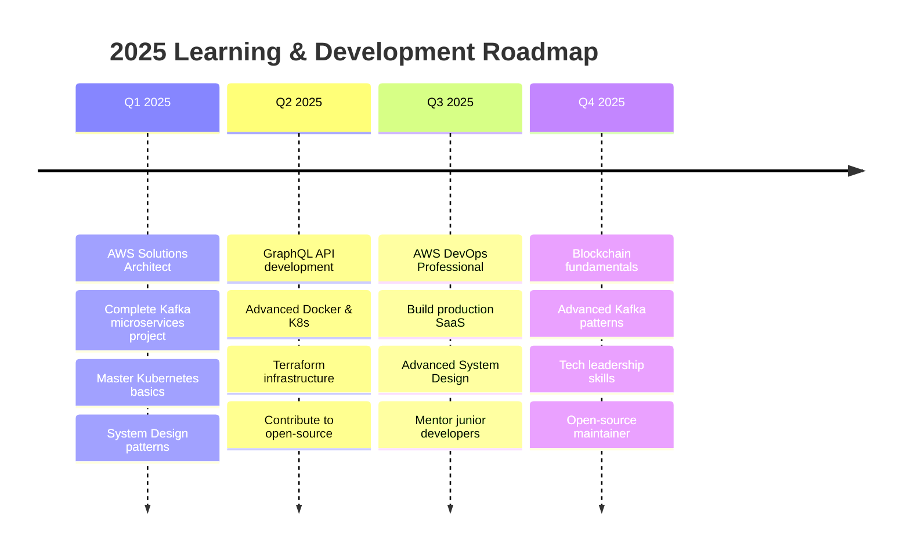

 <div align="center">

#  Hi, I'm Aiden (Shivam Kumar Sharma)


### 🚀 Full-Stack MERN Developer | Freelancer | AI Prompt Engineer | Cloud Learner

[](https://github.com/Aiden781Xx)
[](https://github.com/Aiden781Xx)
[](https://github.com/Aiden781Xx)
[](https://github.com/Aiden781Xx/Aiden781Xx/actions/workflows/snake.yml)
<br>
</div>


##  About Me

```typescript
const aiden = {
  role: "Full-Stack Developer & Backend Engineer",
  location: "Delhi, India 🇮🇳",
  
  expertise: {
    backend: ["Node.js", "Express.js", "RESTful APIs", "Microservices"],
    frontend: ["React.js", "Next.js", "TypeScript", "Tailwind CSS"],
    databases: ["MongoDB", "MySQL", "PostgreSQL", "Redis"],
    cloud: ["AWS (EC2, S3, Lambda)", "Docker", "CI/CD"],
    architecture: ["System Design", "Event-Driven", "MVC Pattern"]
  },
  
  currentlyLearning: ["Kubernetes", "Apache Kafka", "GraphQL", "AWS Solutions Architecture"],
  
  goals2024: [
    "Master System Design patterns",
    "Build production-grade microservices",
    "Contribute to open-source projects",
    "Achieve AWS Solutions Architect certification"
  ],
  
  philosophy: "Build scalable, Ship fast, Automate everything 🚀"
};
```


##  Tech Stack & Expertise

<div align="center">

### 💻 Languages & Frameworks


### 🗄️ Databases & Caching


### ☁️ Cloud & DevOps


### 🛠️ Tools & Technologies


</div>


## 📊 Skill Proficiency & Learning Progress

<div align="center">

### 🎯 Core Competencies

| Technology | Proficiency | Experience | Status |
|:-----------|:------------|:-----------|:-------|
| **Node.js + Express** |  | 2+ years | 🔥 Expert |
| **React.js** |  | 2+ years | ⚡ Advanced |
| **MongoDB** |  | 2+ years | ⚡ Advanced |
| **JavaScript/TypeScript** |  | 2+ years | 🔥 Expert |
| **REST API Design** |  | 2+ years | 🔥 Expert |
| **MySQL/PostgreSQL** |  | 1.5+ years | ⚡ Advanced |
| **Next.js** |  | 1+ year | ⚡ Advanced |
| **Redis Caching** |  | 1+ year | 📈 Intermediate |
| **Docker** |  | 1+ year | 📈 Intermediate |
| **CI/CD (GitHub Actions)** |  | 1+ year | ⚡ Advanced |

### 🌱 Currently Learning

| Technology | Progress | Target | Status |
|:-----------|:---------|:-------|:-------|
| **AWS Solutions Architecture** |  | Dec 2025 | 🯠Active |
| **Kubernetes** |  | Jan 2025 | 🯠Active |
| **Apache Kafka** |  | Feb 2025 | 🯠Active |
| **System Design** |  | Ongoing | 🯠Active |
| **GraphQL** |  | Mar 2025 | 📚 Learning |
| **Terraform (IaC)** |  | Q1 2025 | 📚 Learning |
| **Microservices Architecture** |  | Ongoing | 🯠Active |

</div>


##  Architecture & System Design

<div align="center">


### 🏗️ Architecture Patterns I Work With

<table>
<tr>
<td width="33%" align="center">

<br><strong>Microservices</strong>
<br>Event-Driven Architecture
</td>
<td width="33%" align="center">

<br><strong>RESTful APIs</strong>
<br>Clean Architecture Pattern
</td>
<td width="33%" align="center">

<br><strong>Cloud Native</strong>
<br>Containerized Deployments
</td>
</tr>
</table>

</div>


## 🏆 Featured Projects

<div align="center">

<table>
<tr>
<td width="50%">

### 📚 E-Learning Platform


**Production-Ready MERN Stack Application**

```yaml
Architecture:
  ├─ Role-Based Access Control (RBAC)
  ├─ JWT Authentication & Authorization
  ├─ Video Streaming (AWS S3)
  ├─ Payment Gateway Integration
  └─ Course Management System

Tech Stack:
  Backend: Node.js, Express, MongoDB, Redis
  Frontend: React, Redux, TailwindCSS
  Cloud: AWS S3, EC2
  Auth: JWT, bcrypt, OAuth2.0
```

[](https://github.com/Aiden781Xx)
[](https://demo.com)

</td>
<td width="50%">

### 📊 Real-Time Analytics Dashboard


**High-Performance Data Pipeline**

```yaml
Features:
  ├─ Real-Time Data Visualization
  ├─ MongoDB Aggregation Pipeline
  ├─ Redis Caching Layer
  ├─ Rate Limiting & Throttling
  └─ Responsive Chart.js Dashboard

Tech Stack:
  Backend: Express, MongoDB, Redis
  Frontend: React, Chart.js, D3.js
  Deploy: Docker, AWS EC2, Nginx
  Monitor: PM2, CloudWatch
```

[](https://github.com/Aiden781Xx)
[](https://demo.com)

</td>
</tr>
<tr>
<td width="50%">

### 🛰️ Kafka Microservices Lab


**Event-Driven Architecture Sandbox**

```yaml
Implementation:
  ├─ Producer-Consumer Pattern
  ├─ Topic Partitioning Strategy
  ├─ Message Persistence & Replay
  ├─ Dead Letter Queue Handling
  └─ Docker Compose Setup

Tech Stack:
  Messaging: Apache Kafka, Zookeeper
  Services: Node.js, Express
  Container: Docker, Docker Compose
  Monitor: Kafka Manager, Prometheus
```

[](https://github.com/Aiden781Xx)
[](https://github.com/Aiden781Xx)

</td>
<td width="50%">

### ☁️ AWS Cloud Infrastructure


**Terraform Infrastructure as Code**

```yaml
Infrastructure:
  ├─ VPC with Public/Private Subnets
  ├─ Auto-Scaling EC2 Instances
  ├─ Application Load Balancer
  ├─ RDS Multi-AZ Database
  └─ S3 + CloudFront CDN

Tech Stack:
  IaC: Terraform, AWS CloudFormation
  Compute: EC2, Lambda, ECS
  Database: RDS (PostgreSQL), DynamoDB
  Storage: S3, EBS, EFS
  Network: VPC, Route53, CloudFront
```

[](https://github.com/Aiden781Xx)
[](https://github.com/Aiden781Xx)

</td>
</tr>
</table>

</div>


## 📈 GitHub Analytics

<div align="center">


<br><br>


<br>


<br><br>


</div>


## 🐍 Contribution Snake Animation

<div align="center">

<picture>
  <source media="(prefers-color-scheme: dark)" srcset="https://raw.githubusercontent.com/Aiden781Xx/Aiden781Xx/output/github-contribution-grid-snake-dark.svg">
  <source media="(prefers-color-scheme: light)" srcset="https://raw.githubusercontent.com/Aiden781Xx/Aiden781Xx/output/github-contribution-grid-snake.svg">
  
</picture>

<br>

**🎮 Watch the snake eat my contributions! Updates every 12 hours.**

[](https://github.com/Aiden781Xx/Aiden781Xx/actions/workflows/snake.yml)

</div>


## 🎯 Current Learning Roadmap

<div align="center">



### 🎓 Certifications & Goals

| Certification | Status | Target Date |
|--------------|--------|-------------|
| AWS Solutions Architect Associate | 🎯 In Progress | Mar 2025 |
| AWS DevOps Engineer Professional | 📚 Planned | Aug 2025 |
| Certified Kubernetes Administrator (CKA) | 📚 Planned | Jun 2025 |
| MongoDB Certified Developer | ✅ Completed | - |

</div>


## 🌟 Development Philosophy

<div align="center">

<table>
<tr>
<td width="25%" align="center">
<br>
<strong>Scalability First</strong><br>
<sub>Design systems that grow</sub>
</td>
<td width="25%" align="center">
<br>
<strong>Clean Architecture</strong><br>
<sub>SOLID principles & patterns</sub>
</td>
<td width="25%" align="center">
<br>
<strong>Test-Driven</strong><br>
<sub>Quality over speed</sub>
</td>
<td width="25%" align="center">
<br>
<strong>Automate Everything</strong><br>
<sub>CI/CD & DevOps mindset</sub>
</td>
</tr>
</table>

### 💭 Code Philosophy

> **"Any fool can write code that a computer can understand. Good programmers write code that humans can understand."** - Martin Fowler

```python
class Developer:
    def __init__(self):
        self.code_quality = ["Clean", "Testable", "Scalable", "Maintainable"]
        self.approach = "API-First Design"
        self.mindset = "Build to Last, Not Just to Launch"
        
    def daily_routine(self):
        return [
            "☕ Coffee",
            "💻 Code",
            "🧪 Test",
            "📚 Learn",
            "🚀 Deploy",
            "🔄 Repeat"
        ]
```

</div>


## 📫 Connect With Me

<div align="center">

[](https://linkedin.com/in/yourprofile)
[](https://twitter.com/yourprofile)
[](mailto:your.email@example.com)
[](https://yourportfolio.com)
[](https://dev.to/yourprofile)
[](https://medium.com/@yourprofile)

<br>

### 💬 Let's Collaborate!

**I'm interested in:**
- 🚀 Backend & Cloud Architecture projects
- 🏗️ System Design discussions
- 🤝 Open-source contributions
- 💼 Freelance opportunities
- 🎓 Mentoring & knowledge sharing

**Feel free to reach out for collaborations or just a tech chat!**


</div>


## 🏆 GitHub Trophies

<div align="center">


</div>


## 📊 Weekly Development Stats

<!--START_SECTION:waka-->
<!--END_SECTION:waka-->

<div align="center">


<br>


<br><br>

**⭐ If you like my work, consider giving a star to my repositories!**


</div>
